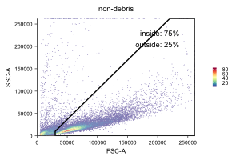
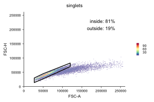
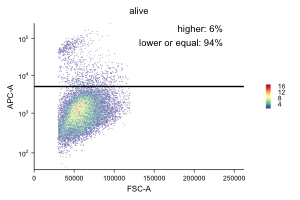
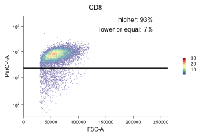

Install FlowYo:
```
remotes::install_github("https://github.com/gernophil/FlowYo")
```
Example for the usage FLowYo (for polygons make sure the first and the last point are identical):
```
library(FlowYo)

fcs_data <- read_fcs("example/isolated_hCD8_tcells.fcs")

non_debris <- gate_fcs(fcs_data,
                        name = "non-debris",
                        x = "FSC-A",
                        y = "SSC-A",
                        filter_gate = data.frame(x = c(30000, 30000, 220000, 262143, 262143, 30000),
                                                y = c(0, 10000, 262143, 262143, 0, 0)),
                        gate_type = "polygon",
                        gate_name = "non-debris",
                        filter_type = "inside",
                        # additional_gates = NULL,
                        transform_x = FALSE,
                        transform_y = FALSE,
                        plot_type = "hexagon",
                        print_plot = TRUE)
```

```
singlets <- gate_fcs(non_debris$gated,
                    name = "singlets",
                    x = "FSC-A",
                    y = "FSC-H",
                    filter_gate = data.frame(x = c(27000, 27000, 50000, 120000, 120000, 50000, 27000),
                                            y = c(14000, 30000, 45000, 82500, 70000, 27000, 14000)),
                    gate_type = "polygon",
                    gate_name = "singlets",
                    filter_type = "inside",
                    # additional_gates = NULL,
                    transform_x = FALSE,
                    transform_y = FALSE,
                    plot_type = "hexagon",
                    print_plot = TRUE)
```

```
alive <- gate_fcs(singlets$gated,
                name = "alive",
                x = "FSC-A",
                y = "APC-A",
                filter_gate = 5000,
                gate_type = "threshold_y",
                gate_name = "alive",
                filter_type = "lower_or_equal",
                # additional_gates = NULL,
                transform_x = FALSE,
                transform_y = TRUE,
                plot_type = "hexagon",
                print_plot = TRUE)
```

```
cdeight <- gate_fcs(alive$gated,
                    name = "CD8",
                    x = "FSC-A",
                    y = "PerCP-A",
                    filter_gate = 2300,
                    gate_type = "threshold_y",
                    gate_name = "CD8",
                    filter_type = "higher",
                    # additional_gates = NULL,
                    transform_x = FALSE,
                    transform_y = TRUE,
                    plot_type = "hexagon",
                    print_plot = TRUE)

```

